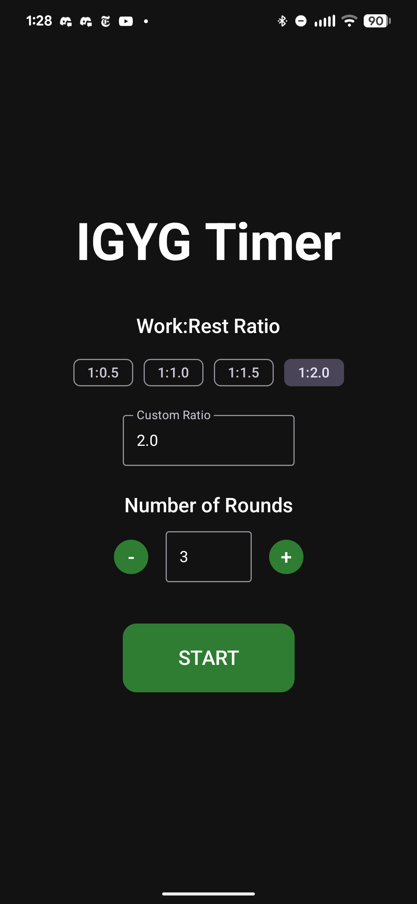

# IGYG Timer

A workout timer with **dynamic rest calculation** — rest periods are computed from your actual work time, not pre-set intervals.

## What is IGYG?

"I Go You Go" (IGYG) is a partner training methodology where one person works while the other rests, then they switch. Your rest naturally equals however long your partner took. This app replaces the partner for solo training — no existing timer calculates rest dynamically based on actual work time.

## How It Works

```
Work (open-ended) → Tap Done → Rest auto-calculated → Next round
```

1. **Work phase**: Timer counts up. Finish when you finish.
2. **Tap Done**: Rest is calculated as `work time × ratio`
3. **Rest phase**: Countdown with audio beeps at 3, 2, 1
4. **Repeat**: Automatic transition to next round

## Screenshots

<p align="center">
  
  
  
  
  
</p>

## Ratio Examples

| Ratio | 60s Work → Rest | Use Case |
|-------|-----------------|----------|
| 0.5 | 30s | High-intensity conditioning |
| 1.0 | 60s | Standard IGYG, balanced |
| 1.5 | 90s | Moderate recovery |
| 2.0 | 120s | Strength focus, full recovery |

## Features

- Configurable work:rest ratio (presets + custom decimal)
- Configurable rounds (2-100+)
- Pause/resume mid-workout
- Stop with confirmation dialog
- Background execution with notification
- Audio countdown beeps (3, 2, 1)
- Gym-readable display (large numbers, high contrast)
- Settings persistence (remembers last config)
- Screen stays on during workout

## Tech Stack

- **Language**: Kotlin 2.0+
- **UI**: Jetpack Compose + Material3
- **Architecture**: MVVM with StateFlow
- **Background**: Foreground Service + Wake Lock
- **Audio**: SoundPool
- **Persistence**: DataStore Preferences
- **Min SDK**: 26 (Android 8.0)
- **Target SDK**: 35

## Build & Run

```bash
# Build
./gradlew build

# Install debug APK
./gradlew installDebug

# Run tests
./gradlew test

# Lint
./gradlew lint
```

## Project Structure

```
app/src/main/kotlin/com/igygtimer/
├── MainActivity.kt           # Single activity entry point
├── model/                    # TimerState, WorkoutConfig
├── viewmodel/                # TimerViewModel
├── repository/               # TimerRepository, SettingsRepository
├── service/                  # TimerService (foreground)
├── audio/                    # BeepPlayer, BeepScheduler
├── ui/
│   ├── screen/               # HomeScreen, TimerScreen, CompleteScreen
│   ├── component/            # TimeDisplay, RoundIndicator, TimerButton
│   └── theme/                # Colors, typography
├── navigation/               # NavGraph and routes
└── util/                     # TimeUtils, TimeProvider
```

## Status

| Phase | Status |
|-------|--------|
| Core timer (work/rest/rounds) | Complete |
| Background service + wake lock | Complete |
| Audio countdown beeps | Complete |
| Settings persistence | Complete |
| Saved workout templates | Planned |
| iOS build | Planned |

## License

MIT
